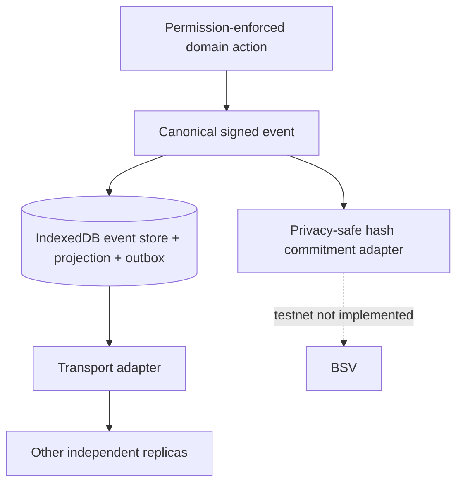

# Distributed architecture proof

## Public/private boundary

The signed **private event** contains operational identifiers and business payload required to rebuild local projections. It is shared only with authorized replicas. The **public BSV commitment** contains an opaque reference and hash, not cadet name, gender, grade, student ID, notes, roster, or identifying issue detail. BSV can timestamp and make tampering evident; it is not the private event database.

## Overlay research spike

An A.R.G.U.S. overlay topic would identify valid privacy-safe audit transactions for one organization/protocol version. A topic manager would validate transaction shape and admission rules; a lookup service would index opaque organization/event keys so clients can discover commitments. Overlay nodes synchronize admissible transactions and can support multiple independently operated providers, but clients still need endpoints to submit and query, and at least one node must be online for low-latency discovery. Overlay storage is not automatically confidential payload storage, notification delivery, wallet custody, authorization policy, or conflict resolution.

An A.R.G.U.S.-specific topic manager and lookup service would therefore be required unless a verified generic service can enforce the same protocol. Multiple providers could reduce endpoint risk only if they independently retain the topic history and clients can verify/deduplicate results. Automatic failover APIs were not verified and are not invented here.

## Private synchronization candidate

Use encrypted signed event objects stored by multiple authorized object/overlay providers, addressed by ciphertext hash. Separate organizational content-encryption keys into epochs. A newly authorized device receives allowed epoch keys through wallet-authenticated encrypted exchange; revocation starts a new epoch. Providers store ciphertext and indexes, clients verify signatures and public commitments after decrypting. Old data already decrypted by a revoked identity cannot be clawed back.

This candidate still needs protocol selection, authenticated key distribution, provider deletion/retention rules, backup governance, availability measurements, metadata-leak analysis, and six-month catch-up testing. Wallet-to-wallet messaging may help exchange keys, but it does not by itself guarantee durable history. Public BSV data cannot recover missing private ciphertext.

The demonstrated mock engine supports offline queuing, retry with stable IDs, duplicates, reordering, provider failure, three independent replicas, and final-unit conflicts. It is not an always-online production service.
