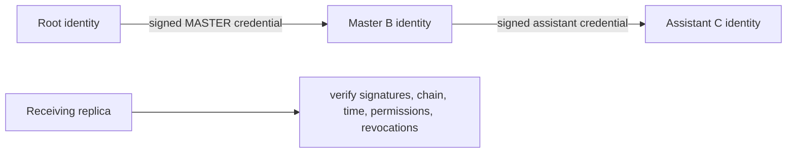

# Stage 2 identity and authorization model

## Status

This is a protocol proof, not production key custody. `MockIdentityProvider` is deliberately non-secret and deterministic. It demonstrates the interface and signature-validation flow only. Browser source, local storage, logs, environment variables, audits, and screenshots must never contain a real private key or seed phrase.

Each person has an independent public identity. A Root identity signs a canonical credential naming a subject, role, explicit permissions, issue time, optional expiry, and issuer. A delegated Master uses its own key; the Root key is never copied.

## Acceptance rules

A replica checks structure, the issuer signature over deterministic canonical bytes, issuer authority at the credential's issue time, role permission bounds, expiry, and effective revocation. Authorization is permission-based in `AuthorizationService`; domain operations call it before changing a projection. UI visibility is not an authorization boundary.

Revocation is signed and prospective: an action timestamped before its effective time remains historical; a new action at or after that time is rejected. A delegated Master's credentials issued before revocation remain historically explainable. Credentials it purports to issue after revocation are rejected. Stage 2 relies on ISO timestamps supplied by signed events; production needs an agreed ordering/anti-backdating policy, trusted time evidence, and replay protection beyond unique IDs.

Production custody, wallet recovery, device enrollment, compromised-key response, threshold governance, and key rotation remain future work. BRC-100-compatible wallet integration is a candidate; it has not been wired into this browser build.
