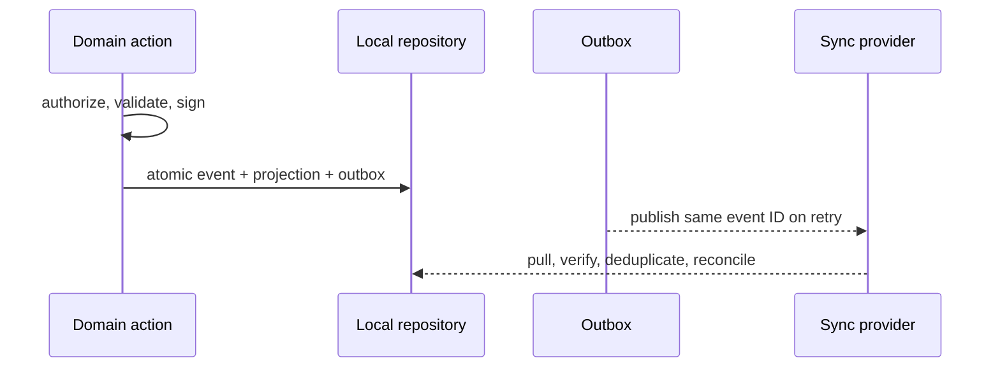

# Offline storage, synchronization, and recovery

## Implemented proof

Each `ArgusReplica` owns a separate repository, event collection, outbox, inventory projection, and conflict collection. Tests use `MemoryRepository`; browsers can use `IndexedDbRepository`. Domain code depends only on `ArgusRepository`, not IndexedDB. Initializing IndexedDB fails visibly when unavailable and does not delete the Stage 1 `localStorage` snapshot. A production migration UI is still required.

An offline mutation is authorized, based on an entity version, canonicalized, signed, applied locally, and atomically persisted with an outbox record. Reconnect publishes the same event ID. Inbound processing verifies signature and permission, deduplicates by event ID, reconciles, then projects.

## Concurrency

Events carry an entity `baseVersion`; there is no global previous-hash chain and no last-write-wins rule. Sequential or safe changes advance the entity version. If two replicas issue the final unit from the same base version, each retains both original events, keeps stock at zero, and creates an open conflict rather than applying the second decrement. An identity with `conflicts.resolve` creates an append-only resolution event. This proof is intentionally narrow: general commutativity, causal graphs, role/credential event ordering, and cross-entity transactions need more design.

## Recovery answers

- **Lost device / three months offline:** it needs a complete signed-event snapshot plus encrypted private payload history from one or more available providers, then replays from a trusted checkpoint. The mock relay proves delivery, not long-term recovery.
- **Provider disappears:** public commitments can prove known event hashes, but cannot reconstruct private payloads. Recovery succeeds only if another authorized encrypted-history replica retained them.
- **Corrupt IndexedDB:** rebuild projections from available signed private events; otherwise local-only events are lost. Export/backup and checkpoint tooling is not implemented.
- **New device:** authorize its identity, deliver current group keys and encrypted history according to policy, validate, and replay. This remains unimplemented.
- **Revoked key:** future events/credentials are rejected. Revocation cannot make already received plaintext or old decryption keys unknowable; future epochs must rotate encryption keys.

No production live subscription, notification service, durable provider, encrypted replication, or automatic failover is claimed.

## Stage 3B.1 user-facing status

The default `MockSyncProvider` is a development transport. Repository persistence and the outbox provide durable local operation, but they do **not** create shared state between physical devices. The UI therefore reports **Local mode**, **Saved locally**, or locally queued changes and never describes the default provider as production synchronized. A real authenticated transport/backend remains a separate milestone.
